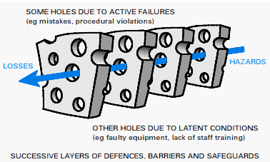
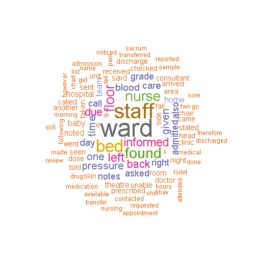
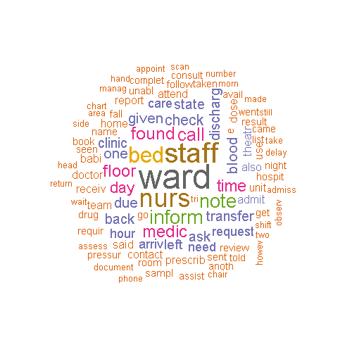
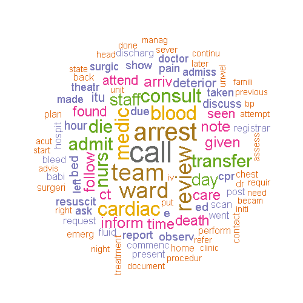
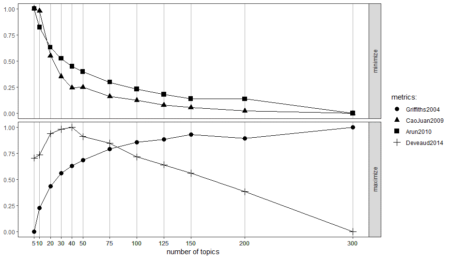
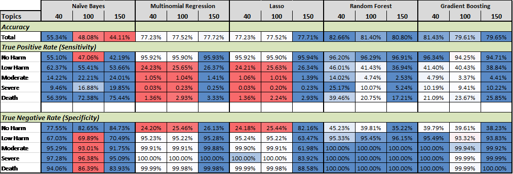
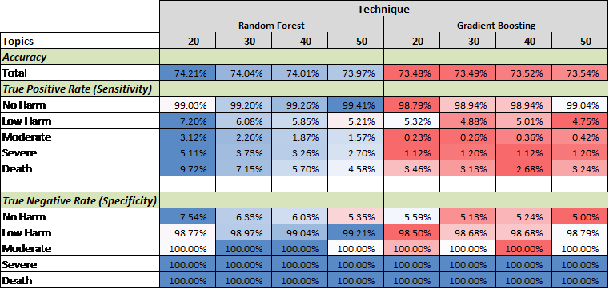

class: middle

```{r setup, include=FALSE}
options(htmltools.dir.version = FALSE)
knitr::opts_chunk$set(fig.width=10, fig.height=6, fig.align = "center", dpi=300,
                      dev.args = list(png = list(type = "cairo")), fig.retina=3) 

library(Cairo)

```


.pull-left[

<br><br><br>
<br><br>

# Text Mining Patient Safety Data

<br><br><br>
<br><br>

`r icon::fa("envelope")` chris.mainey@uhb.nhs.uk

`r icon::fa("globe")` [mainard.co.uk](https://www.mainard.co.uk)

`r icon::fa("github")` [github.com/chrismainey](https://github.com/chrismainey)

`r icon::fa("twitter")` [twitter.com/chrismainey](https://twitter.com/chrismainey)

]

.pull-right[

<br><br><br>
<br><br><br><br>


]


---

# Overview

My PhD work focused on modelling incident reporting in the NHS.


Webinar will cover:

+ What is 'patient safety' and 'incident reporting'?
+ Overview of text mining
+ Introduce the `tidytext` package and approach
+ Introduce topic models
+ Show how this has been applied to incident reporting to:
 + Visualise preparation
 + Visualise terms in reports
 + Model topics
 + Use topics to predict harm-level of incident report


Using Julia Silge's excellent Sherlock Holmes tutorial as examples:
https://github.com/juliasilge/sherlock-holmes

<br>

Material:  https://github.com/chrismainey/Text_Mining_NHS_Incident_Reports
---

# Sponsorship and supervision

.pull-left[
+ Supervised by:
 + Prof. Nick Freemantle - UCL
 + Dr Milena Falcaro - UCL / King's
 
+ Sponsored by UHB
+ UHB input:
 + Prof. Daniel Ray
 + Prof. Simon Ball
 + Dr David McNulty

+ Data and insight from NHS Improvement
 + Dr Frances Healy
 + Dr Julia Abernathy
 + Ms Noreen Gul
]

.pull-right[


]

---

# Patient Safety and Incident Reporting

+ Prevention of errors and adverse effects to patients associated with health care - _World Health Organisation_

+ Increasingly prominent in NHS, after 'An Organisation with memory' ___(Donaldson, 2000)___

--

.pull-left[
+ Incident reporting is seen as a pillar of this:

 + Based on other industries
 + Not implemented in same way ___(Macrae, 2015)___
 + Should be a cue for further investigation
 + 'Tip of the iceberg'
 + Incidents  represent multiple failures of systems
]

.pull-right[

.small[Figure from ___Donaldson (2002)___, based on ___Reason (1990)___.  Defensive systems as solid parts of each slice, holes are vulnerabilities.  Adverse events often result of alignment of several system weaknesses, represented by blue arrow.]
]

---

## The National Reporting and Learning System (NRLS)

_Incidents:_

“Any unintended event caused by the health care that either did or could have led to patient harm”   ___(Sari et al., 2007)___

--

+ Local incident reporting systems, e.g. Datix

--

+ Mapped and submitted to national system (NRLS)

--

+ Examples of learning:

 + Risks in airway management between critical care and other settings ___(McGrath and Thomas, 2011)___
 + Drug-related errors are commonly about wrong administration ___(Cousins et al., 2012) (Franklin et al., 2014))___
 + Risks of shock and death using bone cement for fractured neck of femur surgery ___(Rutter et al., 2014)___
 
--

+ Major problems with data, including completeness, anonymisation, quality of reports etc.


---

# How is it used?

+ Quarterly and monthly figures

 + Counts
 + Is high number of reports good or bad?
 + Different size organisations?
 + Major part of my work was developing risk-adjustment methods to improve this

<br> 
--

+ Manual reading of incident reports:

 + Trained clinical reviewers
 + Qualitative methods
 + NRLS cannot be an exhaustive source
 + Specific targets, or random samples?

---

## See the problem?

--

+ Real signal is in free-text

--

+ Regulator is only able to review 0.5%, representing severe harm or death

--
<br><br>

__“The number of reports received is … huge, so that raises the question of how can we analyse them all properly. Decisions therefore need to be made as to whether we need tighter rules on incident reporting, and the distinction between local and national level reporting and follow-through’__  
<br>
        ___Prof. Sir Liam Donaldson, (Francis, 2013).___

--

<br><br>
## What if we can use text mining methods to help?

---

# Previous work

+ PhD project on text mining ___(Bentham, 2010)___

 + Rendered as high-dimensional matrixm then PCA to reduce dimensionality
 + Anomaly detection based on proximity of clusters in feature space

--
 
+ Commercial partnerships

 + Text mining using LDA and word-clouds on local data ___(Mastodon C, 2019)___

--

+ Local hospital data in graph model based on paragraph embeddings ___(Altuncu et al., 2019)___

 + Technically challenging, but corresponds well with 'hand-coding'

--
 
+ Primary care application ___(Evans et al., 2019)___

 + Words transformed as inputs for regression trees, SVM and Naive Bayes.


---

# My work

Used the `tidytext` package, as easy entry point ___(Silge & Robinson, 2016)___

--

Used the 'bag-of-words' approach:
+ No semantics
+ Order not important, just presence
+ No negation

<br>
--

Spelling, and jargon!
+ Jargon is a major part of clinical noting
+ No validation!  
 + Some reports single letters (despite not being allowed) ___(Bentham, 2010)___
 + Application errors, inluding code fragments ___(Bentham, 2010)___
 + One team found 371 ways of spelling "clostridium difficile" ___(Mayer et al., 2017)___


---
class: middle

# Example 1:
## Processing Sherlock Holmes data

---

# Processes

The text was imported from SQL database in a single column, several million rows, each representing a unique incident report.  The preparation steps were:

- Import to R (watch out for ODBC and varchar(max))!
- Convert to lower case
- Tokenise (split into words, n-grams, or "skip-grams")
- Remove stop words
- Remove additional known 'noise' including possessive endings and non-alpha numeric characters
- Remove dominant word 'patient' and abbreviation 'pt'
- Stemming - reducing variant endings on words (using `SnowballC` stemmer)

--

<br><br>
- Visualise: plots, word-clouds etc.
- TF-IDF? Didn't really help, too many doucments and rare words
- Topic models
- Use topics as predictors of harm

---
# Preparation

```{r tidytext1, eval=FALSE}
tidy_dt <- mydataframe %>%
  unnest_tokens(word, Descrip, token = "words") %>%
  as.data.frame() %>%
  anti_join(get_stopwords()) %>%
  mutate(word = ifelse(word=="pt", "patient", word)) %>%
  filter(!str_detect(word, "patient")) %>%
  mutate(word_clean = str_replace_all(word,"\u2019s|'s","")) %>%
  mutate(word_clean = ifelse(str_detect(word_clean,"[^[:alpha:]]"),NA,word_clean)) %>%
  filter(!is.na(word_clean)) %>%
  add_count(word_clean)


#### Stem ####
library(SnowballC)

tidy_dt2<-tidy_dt %>%
  mutate(word_stem = wordStem(word_clean, language="english"))
```
---

# Visualise 

Whichever method you like!

You could use "word-clouds":

```{r wordcloud, eval=FALSE}
library(wordcloud)
library(RColorBrewer)

# Set up a palette
pal2 <- brewer.pal(8,"Dark2")

tidy_dt2 %>%
  count(word_stem) %>%
  with(wordcloud(word_stem, n, max.words = 100#, color="#E76BF3"
                 , random.order = FALSE, colors=pal2, rot.per = 0, fixed.asp = 90))
```


Can be a bit tricky with window size etc.

---
# Processing word-clouds (1)

.pull-left[
Simply Tokenised

<center></center>

]


.pull-right[
Cleaned

<center></center>

]

---

# Processing word-clouds (2)

.pull-left[
Cleaned, and stop-words removed <br><br>

<center></center>

]


.pull-right[
Cleaned, stop-words removed, and stemmed

<center></center>

]

---

# Words by Harm-level (1)


.pull-left[
### No Harm

<center></center>

]


.pull-right[
### Low Harm

<center></center>

]

---

# Words by Harm-level (2)


.pull-left[
### Moderate Harm

<center></center>

]


.pull-right[
### Severe Harm

<center></center>

]

---

# Words by Harm-level (3)


.pull-left[
### Death

<center></center>

]

.pull-right[
<br>
- "patient" dominated, removed in cleaning and "PT" mapped to "patient"
- "pressur" prevalent in lower harm incidents
- "cardiac" prevalent in severe and death incidents
- words associated with beds, staffing and transfer were common in most levels of harm.

- Size of groups varies hugely

]


---


# Skip-grams by Harm-level (1)


.pull-left[
### No Harm

<center></center>

]


.pull-right[
### Low Harm

<center></center>

]

---

# Skip-grams by Harm-level (2)


.pull-left[
### Moderate Harm

<center></center>

]


.pull-right[
### Severe Harm

<center></center>

]

---

# Skip-grams by Harm-level (3)


.pull-left[
### Death

<center></center>

]

.pull-right[
<br>
- removed single letters
- "blood pressure" and "pressure ulcer" differentiated
- "neuro obs" common in most levels of harm
- "left" side incidents surprisingly common
<br><br>
- skip-grams, even naively constructed, can differentiate between terms that share words


]


---
# Topic Modelling

- Various methods, commonly: Latent Dirichlet Allocation (LDA) _(Blei, 2003)_ 

- Unsupervised model:
 - Generative probabilistic model
 - Three-level structure of terms/words, topics and documents
 - Words distributed across topics, topics distributed across documents
 - Probability of topic, not classification.

--

<br>

- How many topics?
 - Can model as many as you like
 - Various metrics, cross-validation
 - `ldatuning` package is a good option _(Murzintcev, 2019)_

--

<br>

- Can then be use to predict:
 - probability topic represents document ( $\gamma$ )
 - probability word represents a topic ( $\beta$ )

---
class: middle

# Example 2: 
## Topic model for Sherlock Holmes

---

# LDA

Applying this to the NRLS data:

```{r LDA1, eval=FALSE}
library(topicmodels)
library(ldatuning)

dtm<- tidy_dt %>% count(ID, word, sort = TRUE) %>% cast_dtm(ID, word, n)

lda40 <- LDA(dtm, k = 40, method="Gibbs",control=list(seed=123, verbose=1))

LDAtopics <- 
  FindTopicsNumber(
    dtm,
    topics = c(5, seq(10, 50, 10), seq(75, 150, 25), 200,300)
    metrics = c("Griffiths2004",
              "CaoJuan2009", "Arun2010", "Deveaud2014"),
    method = "Gibbs",
    control = list(seed = 77, verbose=1),
    mc.cores = 3L,
    verbose = TRUE
  )

```

---

# Topics



---

# LDA models:

- Words: 40, 100 & 150
- Skip-grams: 20, 30, 40 & 50

--

<br>

Used $\gamma$ predictions in multiclass classification model for harm level:
- __Naive Bayes__ - essentially conditional mean predictors, using `naiveBayes` from `e1071`
- __Multinomial regression__ - using `multinom` from `nnet`
- __LASSO regression__ - penalized regression that shrinks non-predictive inputs to avoid over-fitting, using `cv.glmnet` from `glmnet` (beware, this requires a model matrix input, not a formula interface)
- __Random Forest__ - boostrapped regression trees (and resampled predictors) using `randomForest`, `h2o`, and `caret`
- __Gradient Boosting__ - boostrapped regression trees re-weighted on residuals, using `gbm`, `h2o`, and `caret`
- __Neural network__ - using various multi-layer perceptrons, build using using `keras`


---

# LDA Words results:

<center></center>

- Naive Bayes performed worst, but was conservative due to imbalance
- Random Forest showed best performance

---

# LDA skip-gram results:

<center></center>

- Skip-gram models performed poorer than words
- Random Forest still best performing model

---

# Conclusions
__Incident reporting is big target for text mining!__

- Word-based models are easy to implement, `tidytext` is a great way to access it if you know `tidyverse`

--

- Skip-grams and words together allow differentiation in terms

- Dictionaries of medical/patient safety terms would aid these techniques

- Better validation from submitting Trusts would aid models

<br>
--

- LDA models were helpful for predicting harm level to 82.7%

- Class imbalance is an impediment to many methods, including predicting harm

- More complicated models have also been demonstrated, but topic modelling performed as well as,or better, than other methods.

---

# Where to next?

- Compare topics to clinical review/hand-coding

- Word/paragraph embeddings / Fast-text are next steps

- Identify clusters in feature-space:
 - Targets for review
 - Validate models
 
- Identify similar/related incidents

- Improve searches for incidents in data

--

<br>

### Thank you for your time!

I hope this encourages you to try and apply these methods for yourself!

---
# References (1)

.small[

ALTUNCU, M. T., MAYER, E., YALIRAKI, S. N. & BARAHONA, M. 2018. From Free Text to Clusters of Content in Health Records: An Unsupervised Graph Partitioning Approach. arXiv preprint arXiv:1811.05711.

BLEI, D. M., NG, A. Y. & JORDAN, M. I. 2003. Latent dirichlet allocation. J. Mach. Learn. Res., 3, 993-1022.

BENTHAM, J. 2010. Discovering New Kinds of Patient Safety Incidents. Doctor of Philosophy, Imperial College London.

BENTHAM, J. & HAND, D. J. 2009. Detecting New Kinds of Patient Safety Incidents. In: GAMA, J., COSTA, V. S., JORGE, A. M. & BRAZDIL, P. B. (eds.) Discovery Science, Proceedings.

BENTHAM, J. & HAND, D. J. 2012. Data mining from a patient safety database: the lessons learned. Data Mining and Knowledge Discovery, 24, 195-217.

COUSINS, D. H., GERRETT, D. & WARNER, B. 2012. A review of medication incidents reported to the National Reporting and Learning System in England and Wales over 6 years (2005-2010). Br J Clin Pharmacol, 74, 597-604.

DONALDSON, L. 2000. An organisation with a memory. Deparment of Health. London: The Stationary Office.

DONALDSON, L. 2002. An organisation with a memory. Clin Med, 2, 452-7.

EVANS, H. P., ANASTASIOU, A., EDWARDS, A., HIBBERT, P., MAKEHAM, M., LUZ, S., SHEIKH, A., DONALDSON, L. & CARSON-STEVENS, A. 2019. Automated classification of primary care patient safety incident report content and severity using supervised machine learning (ML) approaches. Health Informatics Journal, 0, 1460458219833102

FRANCIS, R. 2013. Report of the Mid Staffordshire NHS Foundation Trust Public Inquiry : volume 2 : analysis of evidence and lessons learned (part 2), London, The Stationery Office

FRANKLIN, B. D., PANESAR, S. S., VINCENT, C. & DONALDSON, L. J. 2014. Identifying systems failures in the pathway to a catastrophic event: an analysis of national incident report data relating to vinca alkaloids. BMJ Qual Saf, 23, 765-72.

MACRAE, C. 2016. The problem with incident reporting. BMJ Quality & Safety, 25, 71

MASTODON C 2015. NRLS: report on technical prototyping.
]

---
# References (2)

.small[
MASTODON C. 2019. patient safety text mining [Online]. https://www.mastodonc.com/casestudies/nhs/: Mastodon C. Available: https://www.mastodonc.com/casestudies/nhs/ [Accessed 08/03/2019 2019].

MAYER, E., FLOTT, K., CALLAHAN, R. & DARZI, A. 2017. National Reporting and Learning System Research and Development. London: Imperial College London.

MCGRATH, B. A. & THOMAS, A. N. 2011. Patient safety incidents associated with tracheostomies: A comparison of levels of harm between critical care and ward environments. British Journal of Anaesthesia, 106 (3), 439.

MURZINTCEV, N. 2019. ldatuning: Tuning of the Latent Dirichlet Allocation Models Parameters. 1.0.0 ed. CRAN

REASON, J. 1990. Human Error, Cambridge University Press.

RUTTER, P. D., PANESAR, S. S., DARZI, A. & DONALDSON, L. J. 2014. What is the risk of death or severe harm due to bone cement implantation syndrome among patients undergoing hip hemiarthroplasty for fractured neck of femur? A patient safety surveillance study. BMJ Open, 4, e004853.

SARI, A. B., SHELDON, T. A., CRACKNELL, A. & TURNBULL, A. 2007. Sensitivity of routine system for reporting patient safety incidents in an NHS hospital: retrospective patient case note review. BMJ, 334, 79.

SILGE, J. & ROBINSON, D. 2016. tidytext: Text Mining and Analysis Using Tidy Data Principles in R


]


